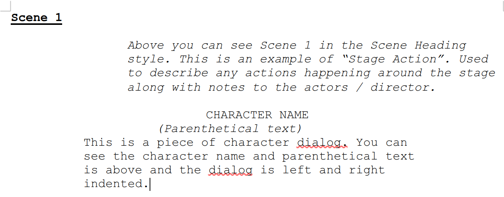
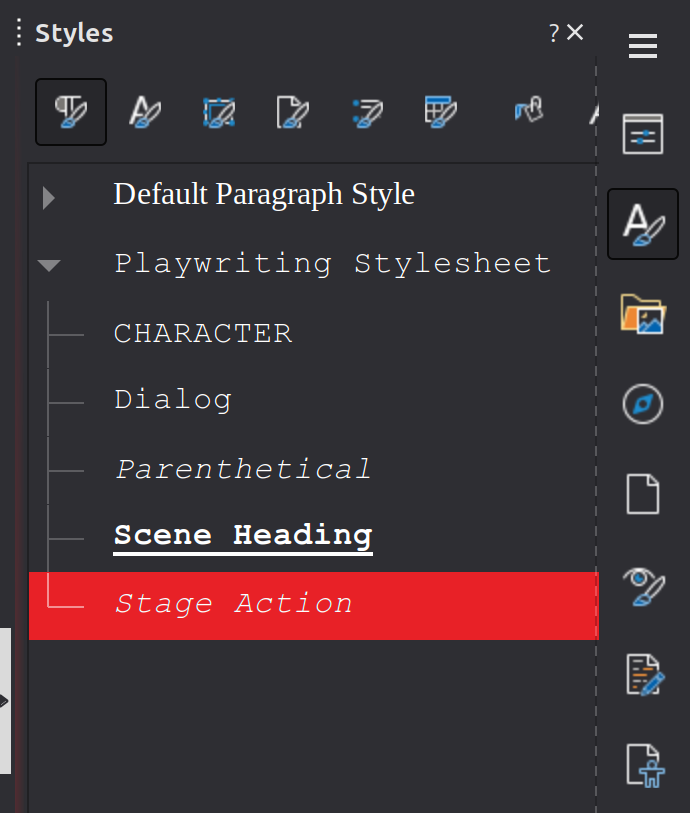

# Playwriting Template for LibreOffice

Adds some playwriting styles into Libreoffice.

---

## Details

- All fonts are in Courier New. Due to licensing of that font it is not included here. 
- All styles are in their own Inherited Styles section called "Playwriting Stylesheet". If you cannot see this open the styles in Libre Office and close up the Default Paragraph Style.

---

## Keyboard Shortcuts
By default keyboard shortcuts are not included in the template. In the folder KeyboardShortcutConfig you will find a cfg file which can be added to LibreOffice by clicking the Tools Menu and selecting Customise. Under the keyboard tab select Load and load the cfg file. This will add the following shortcuts:

### Character
Ctrl + Shift + C
### Dialog
Ctrl + Shift + D
### Parenthetical
Ctrl + Shift + P
### Scene Heading
Ctrl + Shift + S
### Stage Action
Ctrl + Shift + A

---

### Credits
**Dave Pitt**
Last Updated: 16th November 2025